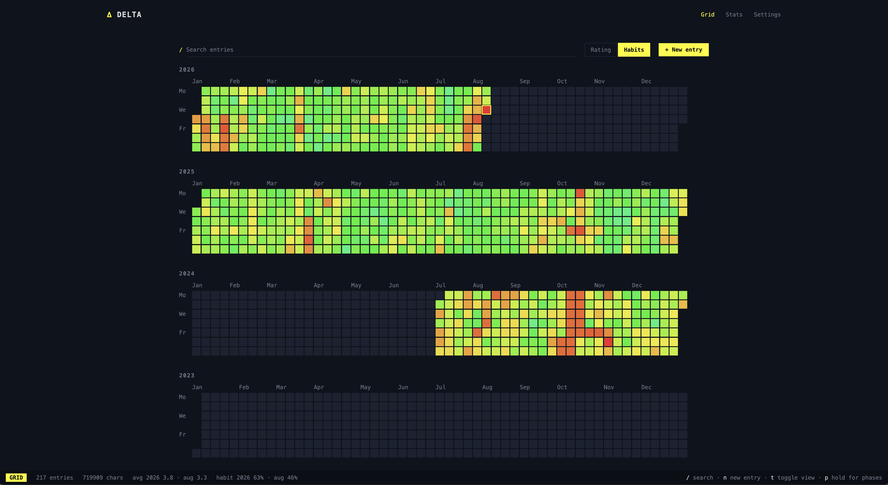
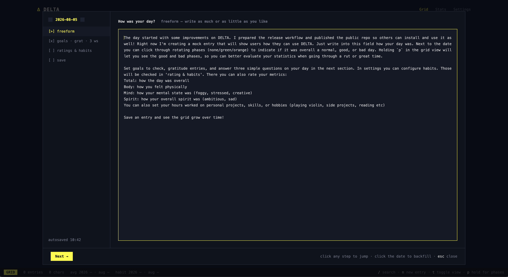
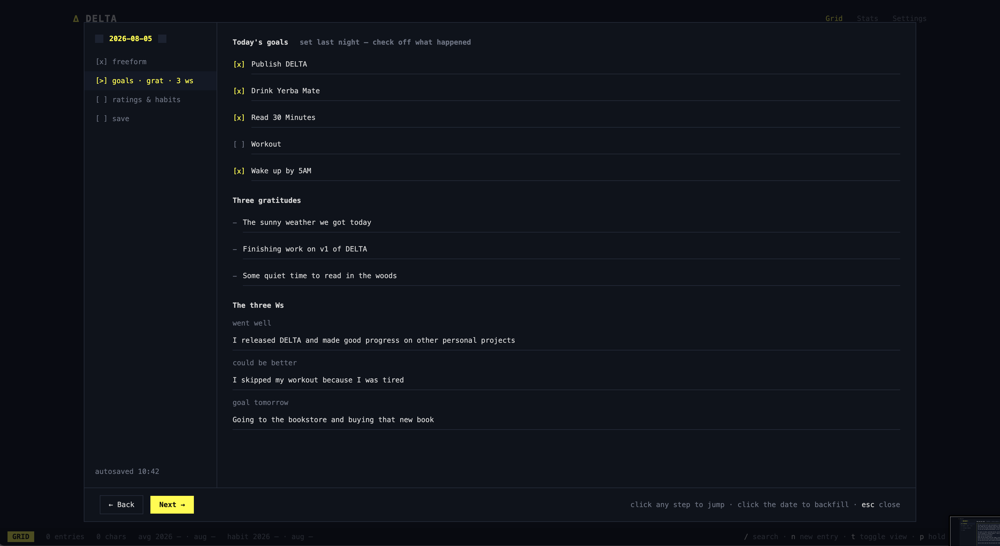
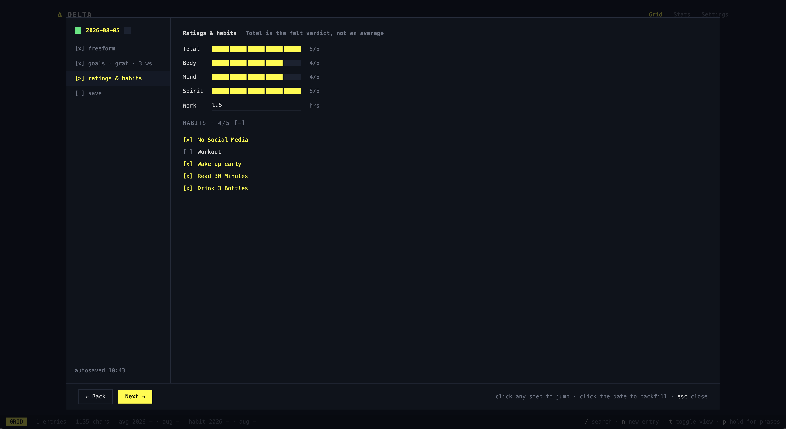
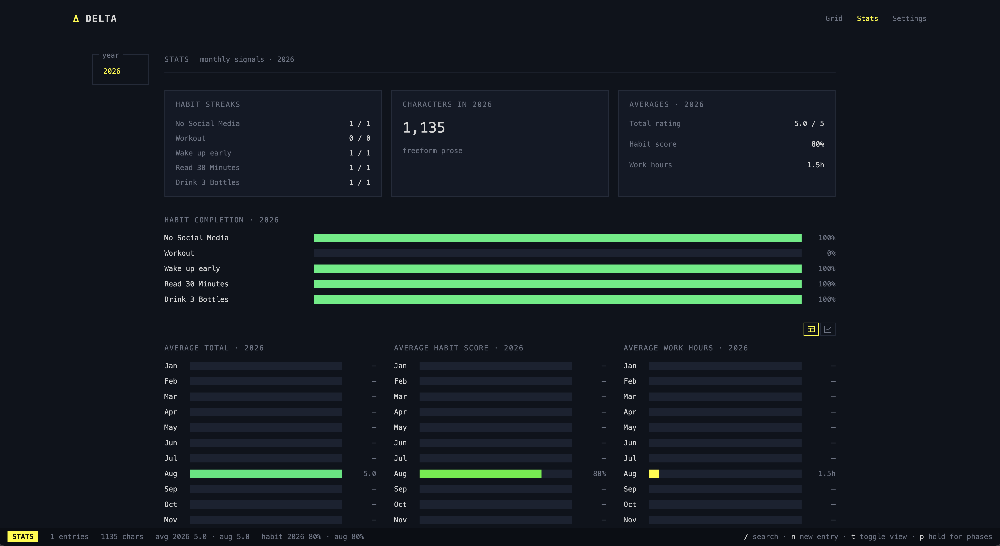

# DELTA

DELTA is a local-first, encrypted diary and habit tracker shipped as one Go
binary. `delta serve` serves the REST API and the embedded dark, monospace web
shell from localhost.

## A day in DELTA

Everything starts at the pixel grid: a year per row, a pixel per day, colored
by your day rating or your daily habit score. It is the map of your diary —
click any pixel to open that day, including empty past days to backfill:



Closing the day is a short guided wizard. It opens with freeform prose — write
as much or as little as you like:



Next come the goals you set for today the night before — check off what
happened — plus three gratitudes and the three Ws: what went well, what could
have gone better, and your goal for tomorrow:



Then rate the day on four 1–5 scales — Total is the felt verdict, never an
average — log hours worked on personal projects, and check off your habits:



Saving rolls straight into setting tomorrow's five goals, and the grid grows by
one pixel. Over time, Stats turns the entries into streaks, per-habit
completion rates, and monthly trends:



## Install

### GitHub Release

Download the archive for your platform from the [latest GitHub Release](https://github.com/ferriskleier/delta/releases), extract `delta`, and put it on your `PATH`. Releases contain macOS and Linux binaries for both `amd64` and `arm64`, plus a checksum file.

Verify the downloaded archive before extracting it with the checksum file and the checksum tool available on your platform, for example:

```sh
sha256sum -c checksums.txt --ignore-missing
# macOS: shasum -a 256 -c checksums.txt
```

On macOS, Gatekeeper may quarantine a downloaded unsigned binary. If macOS blocks it after you have verified the download, remove that quarantine attribute once:

```sh
xattr -d com.apple.quarantine ./delta
```

DELTA does not require Homebrew and does not currently publish Windows builds or signed/notarized macOS builds.

### Go install

The CGO-free build can also be installed directly with Go:

```sh
go install github.com/ferriskleier/delta/cmd/delta@latest
```

Make sure `$(go env GOPATH)/bin` is on your `PATH`, then verify the install:

```sh
delta --version
```

`delta --version` reports the version, commit, and build date. Release builds receive all three values from ldflags; `go install` provides the module version, while the commit and build date remain `unknown`.

## Build

The Vite output is intentionally generated and ignored by git. Build the
frontend before compiling Go so `go:embed` includes the current static assets:

```sh
cd web
npm install
npm run build
cd ..
go build ./cmd/delta
```

`web/dist/.gitkeep` keeps a fresh checkout buildable before the first frontend
build. It is only a placeholder; the binary used for serving the UI should be
compiled after `npm run build`.

## First run

Run `delta serve` even before initialization. With no config it starts a
localhost-only setup server, prints a `setup:` URL, and best-effort opens that
URL with `open` on macOS (`xdg-open` elsewhere). The browser wizard has both
doors: create a new encrypted diary or open an existing one. After either door
finishes, the same process atomically switches to the authenticated normal
handler; the setup endpoints are no longer available. The final screen shows
the per-machine API token needed by CLI and agent clients.

For headless setup, `delta init --path <p>` and
`delta init --open <p> --key-stdin` remain available.

## Frontend development

Initialize a local diary, start `delta serve` on its default
`127.0.0.1:7331`, then run the Vite server:

```sh
cd web
npm run dev
```

Vite proxies `/api` to `http://127.0.0.1:7331`. Set `DELTA_API_TOKEN` to the
token from the local DELTA config so the dev proxy can authenticate API calls:

```sh
DELTA_API_TOKEN=<api-token> npm run dev
```

Set `DELTA_API_URL` as well to proxy a different local serve address, for
example `DELTA_API_URL=http://127.0.0.1:7444 DELTA_API_TOKEN=<api-token> npm run dev`.

## REST API contract

Entry `checkoffs` values are stable, stringified habit IDs, never habit names.
The API hides stored check-offs whose habit is outside its validity range for
the entry date, but never deletes those stored values. `PUT /api/entries/:date`
rejects `checkoffs`; use the dedicated check-off endpoints. Human-mode
`delta entry show` resolves visible IDs to names with one `/api/habits` request,
while `--json` preserves the IDs.

Habit `PATCH` replaces `ranges` before applying `archived`, so an archive in
the same request is evaluated against the new range set. `position` is clamped
at both edges: negative values move the habit to position `0`, and values at or
above the habit count move it to the last position.

## Habit CLI

With `delta serve` running, habits can be managed through the authenticated
HTTP API from the thin CLI client:

```sh
delta habit list --json
delta habit add "Read" --json
delta habit check "Read" 2026-08-02 --json
delta habit uncheck 2026-08-02 "Read" --json
delta habit archive "Read" --json
```

Habit check/uncheck/archive identifiers accept either a numeric habit ID or an
exact habit name. Check/uncheck dates default to the server's local today and
can also be supplied with `--date`.

## Backups

DELTA writes encrypted snapshots beside the live database in its `backups/`
directory. It keeps every snapshot; there is no automatic retention or
deletion.

- The automatic daily snapshot is taken before the first mutation of the
  local calendar day, so `delta-YYYY-MM-DD.db` contains the previous day-end
  state. It is never overwritten.
- A manual snapshot is available from `POST /api/backup` and `delta backup`
  (or `delta backup --json`). Manual files always use
  `delta-YYYY-MM-DD-HHMMSS.db`, with `-N` added for same-second collisions.
- Before pending schema migrations, DELTA writes a
  `pre-migrate-vN-YYYYMMDD-HHMMSS.db` snapshot.

To restore, stop DELTA first. Use the open-existing setup flow with the
snapshot path and the same encryption key, or point Settings at the snapshot.
To replace the live diary, copy the chosen snapshot over the live database
file while DELTA is stopped, then start DELTA again.

## MCP

`delta mcp` is a native MCP server over stdin/stdout. Start `delta serve`
first; MCP reads the API address and bearer token from the same config as the
CLI and forwards every tool call to that running server. It never opens the
database directly, so the one-writer rule remains intact.

For an MCP client that accepts a `mcpServers` configuration, add:

```json
{
  "mcpServers": {
    "delta": {
      "command": "/absolute/path/to/delta",
      "args": ["mcp"]
    }
  }
}
```

The server exposes `entry_get`, `entry_set`, `entry_delete`, `entries_range`,
`habit_list`, `habit_add`, `habit_patch`, `habit_check`, `habit_uncheck`,
`habit_archive`, `grid`, `stats`, `search`, and `backup`. Dates are always
`YYYY-MM-DD`, and tool errors include the same stable `code` and human
`message` fields as the REST API. If `delta serve` is unavailable, tool calls
return a structured `server_unavailable` error pointing at `delta serve`.
